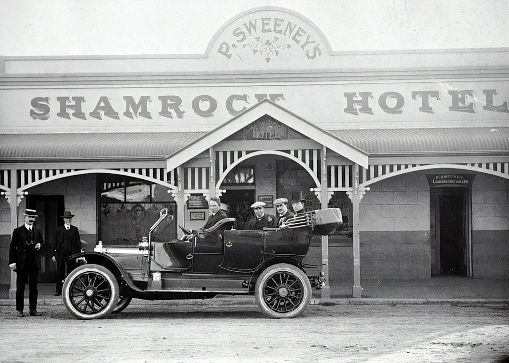

# GenZ Asks: How Did Gen X Get Around Without GPS?

*Imagine a life with no GPS. No longer could you just whip out your smartphones and get directions in seconds. What would you do? How would you get home?*

I came across a [**Reddit**](https://www.reddit.com/) discussion that really struck a chord with me: GenZ had posed the question to GenX: How did you get around without GPS? It's a great question and honestly, it's a humbling one to answer.

Reflecting on life before digital maps makes me appreciate today's technology even more. Writing this has been both eye-opening and nostalgic. I hope it offers younger readers a glimpse into a time when you simply had to use whatever was available. You really didn't have much of a choice. This is one of those times where you won't hear me say, "It was better in my day." Because, truthfully, it's SO much better now.

Today, [**GPS**](https://en.wikipedia.org/wiki/Global_Positioning_System) (Global Positioning System) is embedded in every smartphone. It doesn't just give us directions. It also tracks out real-time location, suggests alternate routes when there is bumper-to-bumper traffic blocking us ahead, and even finds local gas stations, restaurants, and hotels and other businesses near you wherever you are. GPS is indispensable whether you're driving across the country, or hopping on public transport in a new city.

But back then, we got around using whatever resource we had - whether it was paper maps, road atlases, verbal directions from someone who knows the are, etc. But let's take a trip together and see how GenX and the generations before GenX navigated the world. Well, if we're going to do this properly, we might as well start from the very beginning.

</img>

## The Birth of the Automobile in America

Before cars, we had out horst and buggies - the original horsepower, if you will. Travel was limited. Usually you traveled within your home town, or even to the next town. But usually, you stayed relatively local.

But the cars started appearing in the early 1900s. The idea of everyone owning a car was revolutionary. But then Ford (or should I say "dropped) the [**Model T**](https://en.wikipedia.org/wiki/Ford_Model_T) in 1908. And that changed everything. The Model T was affordable, durable and versatile.

It was the hot product of the early 1900s. Everybody wanted one. And why not? The Model T was priced so people could actually afford one, and it was great value for money. Considering, a lot of the roads back then were not yet paved. They were still dirt and mud. But the Model T rose to the challenge. You can see film clips of the Model T going through all kinds of terrain, just bouncing along like a happy, little puppy.

https://youtu.be/m1rlyl8VZFM?si=IiyBywUWEyOHfKmv

In the early days, not only were the roads not paved, but there wasn't too many gas stations to power their new vehicles. Because of the hot demand of the Model T, gas stations started being built, and roads started being paved. Even the first versions of a highway system was being built to call all kinds of goods over the road to all over the country, thanks to the Ford Model T.

## The Interstate Highway System

In the 1940s, when America was in the thick of World War II, [**Dwight Eisenhower**](https://en.wikipedia.org/wiki/Dwight_D._Eisenhower) saw the Autobahn in Germany and how it was easy to travel over it, and how it snaked over the German landscape. He wanted an Autobahn for America. And he made it happen, and it turned out to be the biggest public works project that created the Eisenhower Interstate System. It took from 1950-1970 to complete, and we didn't get the speeds of the [**Autobahn**](https://en.wikipedia.org/wiki/Autobahn), but the [**Interstate Highway System**](https://en.wikipedia.org/wiki/Interstate_Highway_System) was planned so well, you can actually navigate using it. 

**Follow the Numbering System:**

- When you are on an **even**-numbered highway, like I-10, I-20, or I-80, you're traveling East to West.
- When you are on an **odd**-numbered highway, like I-5, I-75, I-95, you're traveling North to South.
- The **lower** numbers are in the South and West.
- The **higher** numbers are in the North and East.

**Follow Auxiliary Routes:**

- 3-digit Interstate Numbers, like I-405, or I-285, are spurs or loops around cities.
- If the first number is even, like I-285, usually means that it's a loop around a city.
- If it's odd, like I-195, it's usually a spur that connects to a city directly.

**Watch the exit signs around cities:**

- Highway signs list upcoming cities, usually the major cities along the route.
- Exit numbers often correspond to mile markers, so you can estimate distance.

**Other signs to look for:**

- Signs before the exit labeled "FOOD," "LODGING," "GAS," will show you business off the upcoming exit and how you get to them.
- Mile markers, are on little green signs, that tell you how many miles that you have left to go.

https://youtu.be/8Fn_30AD7Pk?si=stnjovLeM_D9TuSe

## See The USA in your Chevrolet

In the late 1940s, there was a television show called, "The Dinah Shore Show," starring America's Sweetheart, [**Dinah Shore**](https://en.wikipedia.org/wiki/Dinah_Shore). And she used to sing, "See The USA in your Chevrolet."

https://youtu.be/qhR8GZ_WWMM?si=peBPOHCRwWKyE9AJ

It wasn't so much about the advertisement for the Chevrolet. It was the message the commercial was sending out over the air waves that was special. See the United States right from the comfort of your own car. It was becoming possible that you could actually plan a road trip across America. The birth of the America Road Trip. Soon, we Were planning road trips to visit family for the holidays.

*C'mon kids, help me plan a trip to go see Grandma for Thanksgiving this year in Connecticut! Now, let's find where our home is on the map, and we'll highlight our way to Grandma's House."*

Taking a trip like this seemed more possible than ever before.

## Stopping Off At The Gas Station

I don't remember seeing this happen first-hand as a young boy, but I know that it existed at one time. You could also get driving directions and paper maps at the local gas station. You would stop off at the gas station, and the gas station attendant would fill 'er up, top off your fluids, clean your windshields and mirrors, and help you map out your road trip to your destination.

## Paper Maps

You could use paper maps to plan out the route of your road trips. The only challenge was could you successfully fold the paper map back to how you found them? Not only foldable paper maps, but road atlases would help you with longer stretched of highway. The paper maps would give us more details, and the road atlases would give us a much higher view. Sometimes, we would even use a highlighter or a bright marker to highlight the route in the paper maps and road atlases making it easier for everyone to see.

## The Rise of the Car Clubs

Along with all the highways, gas stations, and other infrastructure being built, along came the Automobile Associations, car clubs, and rental car businesses, etc. One of the most famous of these is the [**AAA**](https://www.acg.aaa.com/?zip=30132&stateprov=ga&city=dallas&devicecd=PC) (American Automobile Association). They're still in operation today, and a handy association to be a member of.

We would stop by the local AAA office, and we would get what they called a TripTik. Today, a TripTik is online and looks more like Expedia.com, or TripAdvisor.com.

But what I remember is that you would the clerk where you were going, and they would collect all of the pertinent maps and bound them together for you in a book to take with you on your trip. These series of maps had a lot of detail on every page. Some page opened up into even larger maps. If you were a member of AAA, the AAA TripTik was definitely the way to go.

## Meeting Up

Sometimes, it was just easier to call someone up and tell them that you were at a local place, and for them to come and get you, and you'd follow them to their home. Simple, right? We did that a lot with our family out in Connecticut. We would call when we arrived at the fire station. Then my Aunt would come, and then we would follow her to her hom. Connecticut had a lot of windy back roads that completely confused my Grandfather, so in our case, the meet up was perfect.

## CB Radios

In the 1970s, there was a big [**CB Radio**](https://en.wikipedia.org/wiki/Citizens_band_radio) craze. The over-the-road truckers were already using CB Radios. But then they were installed inside of regular family's station wagons. Sometimes, the family's couldn't pluck up the courage to talk on the CB radio. But if you did, you were treated to the exploits of a character called "Rubber Duck" or something similar, as they drove on down the highway.

*"Breaker-1-9. Smokey at the 145. Hammer Down!"* Which mean, "There's a cop a mile marker 145. Watch your speed."

This CB radio craze was so incorporated into people's lives, but there were songs on the radio at the time called, "[**Convoy**](https://en.wikipedia.org/wiki/Convoy_(song))" by [**C. W. McCall**](https://en.wikipedia.org/wiki/C._W._McCall), and there were popular movies like [**Smokey and The Bandit**](https://www.imdb.com/title/tt0076729/) starring [**Burt Reynolds**](https://en.wikipedia.org/wiki/Burt_Reynolds) and [**Sally Field**](https://en.wikipedia.org/wiki/Sally_Field). And let's not forget those television shows like, "[**Movin' On**](https://www.imdb.com/title/tt0071012/?ref_=fn_all_ttl_1)," "[**The Dukes of Hazard**](https://www.imdb.com/title/tt0078607/?ref_=fn_all_ttl_2)," and "[**BJ and the Bear**](https://www.imdb.com/title/tt0078564/?ref_=fn_all_ttl_1)." It's true, the CB radio took America by storm.

https://youtu.be/bNNsm26RfOg

We would chat with each other as we drove down the highways. We not only got helpful real-time directions, but information like road conditions and traffic situations up ahead. But if the roadways were clear, you would find out that the roads ahead were smooth sailing.

## Web Mapping

In the earlier days of the internet, well at least before Google was a thing, there were a few map websites that we all used to help us get around. Two of them that I'm thinking about right off the top of my head are [**mapquest.com,**](https://www.mapquest.com/) and [**Yahoo!**](https://www.yahoo.com/) had [**"Yahoo! Maps."**](https://en.wikipedia.org/wiki/Yahoo_Maps) mapquest.com is still active today, and it gives you a lot of other information besides maps and driving directions.

The cool thing about mapquest.com is that sometimes, you'd get a coupon mixed within the directions that you would print out and take with you on your trip. There might be discounts for something that you needed for your trip. Maybe it's a free night at a hotel, or maybe a discount for a mean at a popular restaurants.

## Started to Find Patterns

You could imagine how difficult it was having to deal with a collection of papers to shuffle through while you were driving. It would always be better if you pulled over and figure things out while you were parked, obviously. But, to be honest, I didn't do that all the time. 

Once I started taking a lot of these road trips - whether with my family or on a business tripe for work - I realized that the trip started out with me leaving from home and heading to the highway somewhere near my house - so I really didn't need directions for that part of the trip.

Then, that would lead me to the highway. Maybe it would be an hour on one highway, and then three hours on this highway. Well, those directions I could cut them short and write them out myself.

Get off at Exit #3, and the onto the final destination in a town I've never been to before. So, I'll need these directions.

There were a lot of direction that I could simply write on the back of the paper with the final directions. I've reduced the driving directions from 10 pages to 1 just by taking a little time to prepare myself for this trip.

## iPhone Websites

When the iPhone first came out in 2007, one of it's greatest features was how it rendered websites. You had phones that would render websites in a very crippled, stunted manner. Like how the Blackberry used to render websites. but when the iphone came out, you could view websites as if it was on the computer screen. This meant that you could use websites like mapquest.com to navigate a trip much like you do today.

## Satelitte Navigation Systems

These are the [**"Garmin,"**](https://www.garmin.com/en-US/) [**"Tom-Tom,"**](https://www.tomtom.com/) and [**"Magellan"**](https://www.magellangps.com/) devices. These satellite navigation systems were essentially a box that you mounted to your dash in your car very much like we mount our smartphones today.

The first thing that you had to do with these devices, was to update the files that you had inside the navigation system by downloading updated versions of your maps and transferring the files to your satellite navigation. Then you would enter in your destination.

And then came good old GPS as we know it today. It's hard to even imagine our lives without it. Looking back was really lovely and nostalgic for me. Seeing the question originally, I thought about it so much. How *did* we get along before GPS? Well, we did. And I really do appreciate the modern GPS technology that we have now even more than I ever did.

Thank you for joining me on this 125 year technological journey. I hope I remembered to include everything. If there's something I missed, please let me know. I really hope that you liked what you read. Until next time... take care.

## Your Challenge

But let's take this one step further. Let's see what it's like to navigate a trip without GPS today like you would if you were if you were a Gen X'er. How would you navigate before GPS was invented? So, let's do it.

**RULE #1:** You get to choose from any of the methods mentioned above that you would like to use, You could do Mapquest.com, or foldable paper maps, or road atlases. You could even use satellite navigation systems if they still operate today.

**RULE #2:** You can bring your smartphone with you, and you can use any app that you'd like to use. Any app, except Maps and anything else that would access your GPS. Your paper maps and your GPS. No GPS, unless things have can terribly wrong and you seriously need help.

The Challenge is to take a road trip without using the GPS on your smartphone. You can use any of the methods, tips or tricks mentioned above. The choice is yours. Can you do this? I KNOW that you can! But see what it was like for yourself - simply for the experience. If you have a friend, invite them to go with you. Maybe they'll be nice and play the role of Navigator for you. Now, don't forget your best mixtapes, roll down the windows, and enjoy the ride. Happy Travels! 

